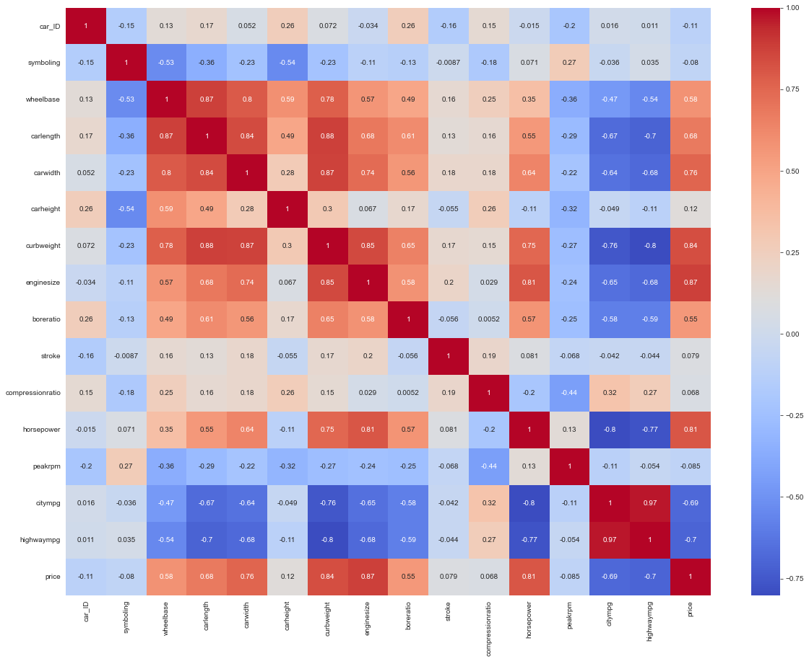
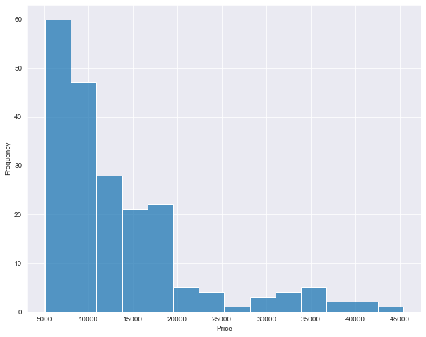

# Portfolio_Project
This repository contains my portfolio project to showcase my skills in data science

# Project 1: Car Price Prediction Model
1) Data preprocessing:
  - Load and clean the car price dataset
  - Handle missing values and remove irrelevant features

2) Model Selection and Training
  - Choose a regression algorithm for car price prediction
  - Split the data into training and testing sets
  - Train the selected model on the training data

3) Prediction and deployment:

  - Use the trained model to predict car prices for new data.
  - Create a user-friendly interface for interacting with the model.
  - Documentation and presentation:

